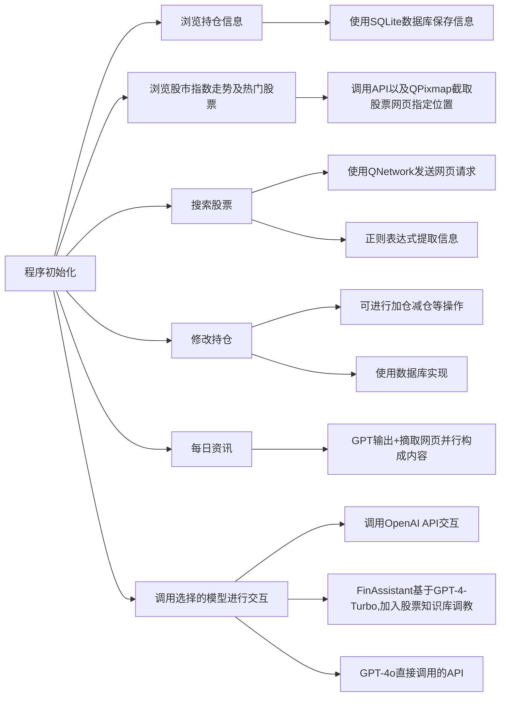

# StockAssistant

# 目的
本项目目的是想设计一个功能全面的炒股软件（如同花顺）。实现一般炒股软件所具有的所有基础功能，同时将AI融入交互环节，打造一个财经Agent（最后完成度比较低，悲
# 设计思路
设计时参照同花顺，实现了同花顺具有的基本功能：股票查询，买入股票，修改持仓（增仓，减仓），以及浏览今日股市行情，查看重要指数的涨跌，热门股票，今日咨询等。数据均能本地保存，重启程序后仍在。同时调用OpenAI GPT的API，制作了一个财经agent（青春版）。具体作用有：
1.	每次程序启动后，针对用户持仓，给提出一些持仓建议；
2.	在用户使用搜索功能后，补充介绍搜索的股票的一些基本信息；
3.	可以使用文本框与GPT直接交互；
4.	每日荐股。
# 具体细节
## 股票信息爬虫（GetStock.cpp）
爬虫实现。使用QNetwork库函数爬取指定网址源代码，然后用正则表达式提取关键词实现信息爬取。
## 持仓信息离线保存(SQLStock.cpp)
 使用的数据库实现（SQLite），将爬取的股票数据保存到数据库中，从而实现离线保存。其中修改持仓信息使用数据库基础语法（创建、修改、删除）等实现。
## AI模型（Core.cpp）
### GPT-4o
比较基础的调用OpenAI官方API
### FinAssistant
这部分是我们做的比较困难的一部分。一个是因为我们使用的Assistant v2今年才推出，比较新，相关教程很稀缺；另一个是即使有相关教程，代码均是python调用openai官方封装好的库，C++代码无法借鉴；同时因功能比较新，GPT自己也写不出来相关代码，只能自己啃OpenAI官方文档来学，对我们来说比较吃力。

#### 具体实现细节：
- #### 模型处理
在OpenAI Platform里用现成的工具微调。主要做的工作就是找知识信息。给其提供了A股所有上市公司基础信息（股票名称+股票代码+近年财务情况）、近一个月股市动态以及经济新闻（以解决GPT知识库落后的问题）、近半年的高质量行情研报以及资讯分析文章。
这部分
- #### 模型调用
因为几乎没有地方提供了Assistant API调用代码的C++实现版本，我们就自己写了一份，具体见：
https://blog.csdn.net/WatsonChen1188/article/details/138978083?spm=1001.2014.3001.5501
调用的过程是用json格式发送指定格式的request调用OpenAI官方API实现交互。

### Llama-3
Llama-3采用本地部署，模型选用的是Llama-3的8B版本的LoRA版本（中文强化版）（模型地址
https://github.com/ymcui/Chinese-LLaMA-Alpaca）
本地推理借助的是llama.cpp实现（项目位置
https://github.com/ggerganov/llama.cpp）
在部署Llama-3时候，我们同样发现市面上的教程基本全都是基于Linux系统或MacOS实现，跟Windows实现差异较大（可能只有我们这种小白会用Windows部署😂），之后可能会做一个windows部署的教程

## 股市走势展示（Get_Url_Pic.cpp）
先调用ScreenShot API抓取源网页截屏保存到本地，再用QPixMap截取指定位置的图片，呈现在UI上

# 代码结构

# 测试用例
## 股市指数信息展示
点击combobox，选择选项可切换内容

## 搜索功能展示

输入股票代码，点击“查询”即可获得股票信息
### 代码鲁棒性

若输入错误的股票代码，系统会提示输入正确的股票代码
## 修改持仓功能展示

可选择相应股票进行加仓减仓操作
### 代码鲁棒性

如果输入的减仓数大于持仓数，则会提醒用户
## 每日资讯展示

结合GPT+网页新闻形成内容
## GPT交互展示

在文本框输入内容，即可收到GPT回复
## FinAssistant与GPT-4o对比
FinAssistant基于GPT-4-Turbo微调，加入了股票专业知识；GPT-4o使用的原生模型。

以上是在同样的prompt下，两个模型的回答，可以看到，GPT-4o有明显事实性错误，FinAssistant在知识库加持下更加准确严谨

# 核心代码解释部分
因篇幅较长，见核心代码解释.md
