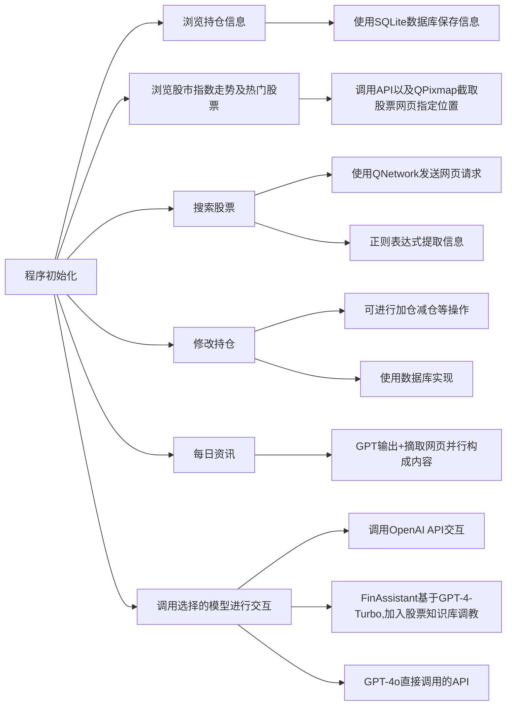

# 目的
本项目目的是想设计一个功能全面的炒股软件（如同花顺）。实现一般炒股软件所具有的所有基础功能，同时将AI融入交互环节，打造一个财经Agent（最后完成度比较低，悲
# 设计思路
设计时参照同花顺，实现了同花顺具有的基本功能：股票查询，买入股票，修改持仓（增仓，减仓），以及浏览今日股市行情，查看重要指数的涨跌，热门股票，今日咨询等。数据均能本地保存，重启程序后仍在。同时调用OpenAI GPT的API，制作了一个财经agent（青春版）。具体作用有：
1.	每次程序启动后，针对用户持仓，给提出一些持仓建议；
2.	在用户使用搜索功能后，补充介绍搜索的股票的一些基本信息；
3.	可以使用文本框与GPT直接交互；
4.	每日荐股。
# 具体细节
## 股票信息爬虫（GetStock.cpp）
爬虫实现。使用QNetwork库函数爬取指定网址源代码，然后用正则表达式提取关键词实现信息爬取。
## 持仓信息离线保存(SQLStock.cpp)
 使用的数据库实现（SQLite），将爬取的股票数据保存到数据库中，从而实现离线保存。其中修改持仓信息使用数据库基础语法（创建、修改、删除）等实现。
## AI模型（Core.cpp）
### GPT-4o
比较基础的调用OpenAI官方API
### FinAssistant
这部分是我们做的比较困难的一部分。一个是因为我们使用的Assistant v2今年才推出，比较新，相关教程很稀缺；另一个是即使有相关教程，代码均是python调用openai官方封装好的库，C++代码无法借鉴；同时因功能比较新，GPT自己也写不出来相关代码，只能自己啃OpenAI官方文档来学，对我们来说比较吃力。

#### 具体实现细节：
- #### 模型处理
在OpenAI Platform里用现成的工具微调。主要做的工作就是找知识信息。给其提供了A股所有上市公司基础信息（股票名称+股票代码+近年财务情况）、近一个月股市动态以及经济新闻（以解决GPT知识库落后的问题）、近半年的高质量行情研报以及资讯分析文章。
这部分
- #### 模型调用
因为几乎没有地方提供了Assistant API调用代码的C++实现版本，我们就自己写了一份，具体见：
https://blog.csdn.net/WatsonChen1188/article/details/138978083?spm=1001.2014.3001.5501
调用的过程是用json格式发送指定格式的request调用OpenAI官方API实现交互。

### Llama-3
Llama-3采用本地部署，模型选用的是Llama-3的8B版本的LoRA版本（中文强化版）（模型地址
https://github.com/ymcui/Chinese-LLaMA-Alpaca）
本地推理借助的是llama.cpp实现（项目位置
https://github.com/ggerganov/llama.cpp）
在部署Llama-3时候，我们同样发现市面上的教程基本全都是基于Linux系统或MacOS实现，跟Windows实现差异较大（可能只有我们这种小白会用Windows部署😂），之后可能会做一个windows部署的教程

## 股市走势展示（Get_Url_Pic.cpp）
先调用ScreenShot API抓取源网页截屏保存到本地，再用QPixMap截取指定位置的图片，呈现在UI上

# 代码结构


# 测试用例
## 股市指数信息展示
点击combobox，选择选项可切换内容


## 搜索功能展示

输入股票代码，点击“查询”即可获得股票信息
### 代码鲁棒性

若输入错误的股票代码，系统会提示输入正确的股票代码
## 修改持仓功能展示

可选择相应股票进行加仓减仓操作
### 代码鲁棒性

如果输入的减仓数大于持仓数，则会提醒用户
## 每日资讯展示

结合GPT+网页新闻形成内容
## GPT交互展示

在文本框输入内容，即可收到GPT回复
## FinAssistant与GPT-4o对比
FinAssistant基于GPT-4-Turbo微调，加入了股票专业知识；GPT-4o使用的原生模型。


以上是在同样的prompt下，两个模型的回答，可以看到，GPT-4o有明显事实性错误，FinAssistant在知识库加持下更加准确严谨
# 核心代码解释部分
## 股票信息爬虫（GetStock.cpp）
股票爬虫部分共有
```C++
void getHttpData(const QString&modelUrl,QByteArray & data); 
//获取网页数据，保存为源代码

//获取股票价格
void handleData(QByteArray & data);

//获取股票涨跌
void handleData2(QByteArray &data);

//获取股票涨跌率
void handleData3(QByteArray &data);

//获取股票名称
void handleData4(QByteArray &data);

//整合以上代码实现查询股价
void Search::on_pushButton_3_clicked();
```
这几个核心函数
### 详细代码
获取网页源代码：
```C++
void Getstock::getHttpData(const QString&modelUrl,QByteArray&data)
{
	//设置url地址
    QUrl url(modelUrl);
    QNetworkRequest request;
    
    //将url地址添加到网络请求，发送请求
    request.setUrl(url);
    
    //用reply_来储存收到的回应，即网页源码
    QNetworkReply * reply_ = manager->get(request);
    
    //用eventloop不断循环，等待收到网页发回的reply，其中用到了信号槽实现将收到reply与循环终止相联系
    QEventLoop eventLoop2;
    connect(reply_, &QNetworkReply::finished, &eventLoop2, &QEventLoop::quit);
    eventLoop2.exec(QEventLoop::ExcludeUserInputEvents);
    
    //将收到的信息储存到data中
    data = reply_->readAll();
    reply_->deleteLater();
}
```
函数handledata1-4实现对各种股票信息的获取，代码除了正则表达式不同其他均相同，故下面以handledata4()为例展示如何实现
```C++
void Getstock::handleData4(QByteArray &data)//处理股票名称
{
	//将QByteArray形式的数据转化为String以方便后续处理
    QString str = QString(data);
    
    //设置正则表达式，提取源网页代码中“<h2 class="basic-stock-name">小米集团-W<!-- -->”汉字部分
    QRegularExpression re("<h2 class=\"basic-stock-name\">(.*?)<!-- -->");
    
   //进行提取匹配操作
    QRegularExpressionMatch match = re.match(str);
    if (match.hasMatch()) {
        matchedText = match.captured(1);  // 获取第一个捕获组的匹配内容
        qDebug() << "Extracted Text:" << matchedText;
    } else {
        qDebug() << "No match found";
        //对于报错处理，提示股票代码写错，提高程序鲁棒性
        QMessageBox::critical(nullptr, "错误", "请输入正确的股票代码");
        searchstate=1;
    }
}
```
下面是具体ui交互时，搜索股票信息功能的实现
```C++
void Search::on_pushButton_3_clicked()
{
    QString stocknumber=ui->stocknumberinput->text();
    
    //通过观察网页地址结构可以发现，某个具体股票的网页地址就是该网页主地址+股票代码
    QString web="https://www.laohu8.com/stock/"+stocknumber;
    
    //各种初始化
    QByteArray data;
    Getstock* m=new Getstock;
    m->init();
    
    //开始获取股票名称
    m->getHttpData(web,data);
    m->handleData4(data);
    ui->stocknameoutput->append(m->matchedText);
    
    //如果获取股票名称没有报错，继续处理其他信息
    if(searchstate==0)
    {
    //依次处理各种信息，并在ui中呈现
    m->handleData(data);
    ui->stockpriceoutput->append(m->urlList[0]);
    m->handleData2(data);
    ui->stockrateoutput->append(m->urlList2[0]);
    m->handleData3(data);
    ui->stockrateoutput->append("/"+m->urlList3[0]);
}
```
## SQLite数据库处理股票信息（SQLStock.cpp）
对于股票信息数据处理，使用SQLite完成了以下函数
```C++
//初始化数据库
void initializeDatabase();

//实现买入功能，在数据库中插入新的股票信息
void insertStockData(const QString &stockname, const QString &stocknumber, double initprice, double currentprice, int positionamount);

//实现清仓功能，根据股票代码删除数据库中的指定股票
void deleteStockByNumber(const QString &stocknumber);

//更新股票持仓信息（收益，持仓总额等）
void updatepositionamount(const QString &stockname,int newPositionAmount);

//更新持股的名字列表（获得目前持有股的名字）
void updatestocknamelist();

//调用Getstock获取持仓股票的最新股价，涨跌，并更新持仓收益等信息
void updatestockinfo();
```
具体代码解释见下
### SQLStock核心代码具体讲解
```C++
//初始化数据库，创建数据库的行列，如果没有数据库，则会创建
void initializeDatabase() {
	
	//连接数据库
    if(QSqlDatabase::contains("qt_sql_default_connection"))
      db = QSqlDatabase::database("qt_sql_default_connection");
    else
      db = QSqlDatabase::addDatabase("QSQLITE");
    db.setDatabaseName("finance.db");
    if (!db.open()) {
        qDebug() << "Error: failed to connect to the database." << db.lastError().text();
        return;
    }
    
    //创建构造数据库的query
    QSqlQuery query;
    query.clear();
    // 创建包含所需字段的表
    if (!query.exec("CREATE TABLE IF NOT EXISTS stocks ("
                        "id INTEGER PRIMARY KEY AUTOINCREMENT, "
                        "stockname TEXT, "
                        "stocknumber TEXT, "
                        "initprice REAL, "
                        "currentprice REAL, "
                        "cost REAL, "
                        "positionamount INTEGER, "
                        "profitandloss TEXT, "
                        "profitandlossrate TEXT)")) {
            qDebug() << "Failed to create table:" << query.lastError().text();
            return;
    }
            }

//插入新股票，使用数据库“INSERT”命令
void insertStockData(const QString &stockname, const QString &stocknumber, double initprice, double currentprice,int positionamount) {
	//初始化数据库，连接数据库
    if(QSqlDatabase::contains("qt_sql_default_connection"))
      db = QSqlDatabase::database("qt_sql_default_connection");
    else
      db = QSqlDatabase::addDatabase("QSQLITE");
    db.setDatabaseName("finance.db");
    if (!db.open()) {
        qDebug() << "Error: failed to connect to the database." << db.lastError().text();
        return;
    }

	//创建新query
    QSqlQuery query;
    query.clear();
    if (!query.prepare("INSERT INTO stocks (stockname, stocknumber, initprice, currentprice, cost, positionamount, profitandloss, latestprofitandloss, profitandlossrate) "
                           "VALUES (:stockname, :stocknumber, :initprice, :currentprice, :cost, :positionamount, :profitandloss, :latestprofitandloss, :profitandlossrate)")) {
            qDebug() << "Prepare failed:" << query.lastError().text();
            return;
        }
        
    //用爬取的股价等信息计算仓位，成本等信息
    double q=initprice*positionamount;
    double cost=q;
    double m = currentprice * positionamount-cost;
        QString profitandloss="+"+QString::number(m, 'f', 2);
    if(m<0)
        {
        double M=abs(m);
        profitandloss="-"+QString::number(M, 'f', 2);
    }
    double n = m / cost*100;
    QString profitandlossrate="+"+QString::number(n, 'f', 2)+"%";
    if(n<0)
    {
        n=abs(n);
        profitandlossrate="-"+QString::number(n, 'f', 2)+"%";
    }
    
    //将计算，爬取的信息储存在数据库中
    query.bindValue(":stockname", stockname);
    query.bindValue(":stocknumber", stocknumber);
    query.bindValue(":initprice", initprice);
    query.bindValue(":currentprice", currentprice);
    query.bindValue(":cost", cost);
    query.bindValue(":positionamount", positionamount);
    query.bindValue(":profitandloss", profitandloss);
    query.bindValue(":latestprofitandloss", "+0.00%");
    query.bindValue(":profitandlossrate", profitandlossrate);
    if (!query.exec()) {
        qDebug() << "Insert stock failed:" << query.lastError().text();
    }
    db.close();
}

//其他函数实现方法与上类似，使用了数据库“UPDATE”，“SELECT”等命令
```

## GPT API调用(Core.cpp)
我们提供了两套模型供使用，两套模型的调用方法不同。
### GPT-4o
```C++
    //发送message
    void sendgetmessagerequest();
    
    //接收GPT的response
    void on_responseReceived(QNetworkReply *reply);
```
### FinAssistant
```C++
	//创建thread和run，添加message进thread，发送请求
	void createthreadandrun(QString& input);
	
	//接收openai返回的thread_id和run_id
	void getthreadandrunid();
	
	//获取run的状态
    void getrunstatus();

	//确认run状态，如果是"completed"，进入下一状态
    void checkrunstatus();

	//发送请求获取stepid
    void getstepidrequest();

	//获取回复的message的message_id
    void getmessageid();   

	//根据message_id发送请求获取message
    void sendgetmessagerequest();

	//获取具体message
    void getmessage();
```
### GPT-4o具体实现代码
```C++
//发送request
void Core::sendRequest(QString& input) {
	//初始化访问的request，选择模型，参数等
    QString userInput = input;
    QJsonObject json;
    json["model"] = "gpt-4o";
    QJsonArray messagesArray;
    QJsonObject messageObject;
    messageObject["role"] = "user";
    messageObject["content"] = userInput;
    messagesArray.append(messageObject);
    json["messages"] = messagesArray;
    json["temperature"] = 1;
    json["max_tokens"] = 1000;

    //设置request的url地址，一些header，发送request
    QNetworkRequest request(QUrl("https://api.openai.com/v1/chat/completions"));
    request.setHeader(QNetworkRequest::ContentTypeHeader, "application/json");
    request.setRawHeader("Authorization", "Bearer " + openaiApiKey.toUtf8());
    QNetworkReply *reply = networkManager->post(request, QJsonDocument(json).toJson());
    }


//处理收到的reply，提取其中的content并输出到ui
 void Core::on_responseReceived(QNetworkReply *reply) {
	chatResponse="无输出";
	QString Response;
	qDebug()<<"开始发送prompt"<<chatResponse;
	
	//读取收到的reply，提取其中的"content"部分
	if (reply->error() == QNetworkReply::NoError) {
	    QByteArray response = reply->readAll();
	            QJsonDocument jsonResponse = QJsonDocument::fromJson(response);
	            Response = jsonResponse["choices"].toArray().first().toObject()["message"].toObject()["content"].toString();
	}
	else {
	    Response ="Error: " + reply->errorString();
	}
	
	//对收到的content进行格式上转化，输出到对应的文本框
	chatResponse=Response;
	qDebug()<<"GPT输出完成"<<chatResponse;
     content= QString("<span style='font-size:35px;'>%1</span>")
            .arg(chatResponse);
    ui->chatoutput->clear();
    if(statec==1)
    ui->chatoutput->append(content);
    else if(statec==2)
    everydaynews=content;
	reply->deleteLater();
}
```
### FinAssistant具体实现代码
FinAssistant实现用的代码较多，故展示部分关键函数
```C++
//创建thread和run并发送
void Core::createthreadandrun(QString& input) {
      //一些基础的，按照官方API文档的初始化json
      QString userInput = input;
      QJsonObject messageObject;
      messageObject["role"] = "user";
      messageObject["content"] = input;
      QJsonArray messagesArray;
      messagesArray.append(messageObject);
      QJsonObject threadObject;
      threadObject["messages"] = messagesArray;
      QJsonObject mainObject;
      mainObject["assistant_id"] = "asst_7xUQ2LEmRfBi8Qp4XcA0UzOA";
      mainObject["thread"] = threadObject;
      
      //设置好一些基础的header，发送request
      QNetworkRequest request(QUrl("https://api.openai.com/v1/threads/runs"));
      request.setRawHeader("OpenAI-Beta", "assistants=v2");
      request.setHeader(QNetworkRequest::ContentTypeHeader, "application/json");
      request.setRawHeader("Authorization", "Bearer " + openaiApiKey.toUtf8());
      runthreadreply = networkManager->post(request, QJsonDocument(mainObject).toJson());
      qDebug()<<"create run and thread已发出";
        
      //使用信号槽函数将收到reply与Core::getthreadandrunid()的执行联系起来
      connect(runthreadreply, &QNetworkReply::finished, this, &Core::getthreadandrunid);   
}

//接收返回的run_id和thread_id
void Core::getthreadandrunid()
{
	//当reply正常时执行(用来避免错误)
    if (runthreadreply->error() == QNetworkReply::NoError)
            {
              //初始化处理收到的json，提取"id"和"thread_id"
              QByteArray response = runthreadreply->readAll();
              QJsonDocument jsonResponse = QJsonDocument::fromJson(response);
              QJsonObject jsonObject = jsonResponse.object();
              run_id = jsonObject.value("id").toString();
              thread_id = jsonObject.value("thread_id").toString();
              qDebug()<<"已获取threadid and runid";
            }
            else
            {
                qDebug()<<"Error: " <<runthreadreply->errorString();
            }
    runthreadreply->deleteLater();
    getrunstatus();
}

//每隔2s check一下run的状态，如果还在queued则继续发送
void Core::checkrunstatus();

//run completed后，发送获得stepid的请求
void Core::getstepidrequest() {
	//编辑request请求
	QNetworkRequest request(QUrl("https://api.openai.com/v1/threads/"+thread_id+"/runs/"+run_id+"/steps"));
	request.setRawHeader("OpenAI-Beta", "assistants=v2");
	request.setRawHeader("Authorization", "Bearer " + openaiApiKey.toUtf8());
	if(getstate==1)
	{
	getstepreply = networkManager->get(request);
	qDebug()<<"获取message id已发出";
	
	//通过槽函数将收到reply与getmessageid函数绑定
	connect(getstepreply, &QNetworkReply::finished, this, &Core::getmessageid);
	getstate=0;
	}
}

//处理收到的reply，提取其中的message_id，处理json方式与void Core::getthreadandrunid()相似
void Core::getmessageid();

//发送获取message_id的request，json编辑与void Core::createthreadandrun(QString& input)相似
void Core::sendgetmessagerequest();

//处理getmessage的reply，用到的json处理较复杂，具体可参考openai官方文档来处理
void Core::getmessage()
{
    if (getmessagereply->error() == QNetworkReply::NoError)
            {
	            
            //构造json提取指定内容
               QByteArray response = getmessagereply->readAll();
               QJsonDocument jsonResponse = QJsonDocument::fromJson(response);
               QJsonObject jsonObject = jsonResponse.object();
               if (jsonObject.contains("content") && jsonObject["content"].isArray()) {
                   QJsonArray contentArray = jsonObject["content"].toArray();
                   if (!contentArray.isEmpty() && contentArray[0].isObject()) {
                       QJsonObject contentObject = contentArray[0].toObject();
                       if (contentObject.contains("text") && contentObject["text"].isObject()) {
                           QJsonObject textObject = contentObject["text"].toObject();
                           if (textObject.contains("value")) {
                               message = textObject["value"].toString();
                               qDebug()<<"已获取message";
                               content= QString("<span style='font-size:35px;'>%1</span>")
                                       .arg(message);
                               ui->chatoutput->clear();
                               ui->chatoutput->append(content);
                           }
                       }
                   }
               }
           }
           else
           {
               qDebug()<<"getmessage error: " <<getmessagereply->errorString();
           }
}
```

## 获取股市指数的信息（图片形式）（Get_Url_Pic.cpp）
使用的函数如下：
```C++
//调用ScreenShot API截取指定网站图片，获取图片url
void getScreenshoturl(const QString &url);

//访问url，用QFile下载图片到指定位置
downIURL_to_picture(imgurl,fileName);

//综合上述两个函数实现截取指定位置图片并保存
void on_url_down_clicked();
```
### 具体实现代码
```C++
//调用ScreenShot API截取指定网站图片，获取图片url
void get_url_pix::getScreenshoturl(const QString &name) {
	//设置request的内容
    QUrl apiUrl("https://shot.screenshotapi.net/screenshot");
    QUrlQuery query;
    QString url="https://www.laohu8.com/quotes?quotesMarket=";
    query.addQueryItem("token", "7S2WJFX-XY4M4DG-GDTAQE0-FATM0PV");
    query.addQueryItem("url", url+name);
    query.addQueryItem("full_page", "true");
    query.addQueryItem("output", "json");
    query.addQueryItem("file_type", "png");
    apiUrl.setQuery(query);
    QNetworkRequest request(apiUrl);
    QNetworkAccessManager manager;
    QNetworkReply * reply = manager.get(request);

	//循环，等待reply响应
    QEventLoop loop;
    QObject::connect(reply, SIGNAL(finished()), &loop, SLOT(quit()));
    loop.exec();
    if (reply->error() == QNetworkReply::NoError) {
        QByteArray responseData = reply->readAll();
        QJsonDocument doc = QJsonDocument::fromJson(responseData);
        QJsonObject jsonObj = doc.object();
        QString screenshotUrl = jsonObj["screenshot"].toString();
        imgurl=screenshotUrl;
        }
     else {
        qDebug() << "Error:" << reply->errorString();
    }
    reply->deleteLater();
} 

//得到url后，访问地址获取图片
bool downIURL_to_picture(const QString &url, const QString &fileName)
{
    //构造请求
    QNetworkAccessManager manager;
    QNetworkRequest request;
    request.setUrl(url);
    // 发送请求
    QNetworkReply *reply = manager.get(request);
    //开启一个局部的事件循环，等待响应结束，退出
    QEventLoop loop;
    QObject::connect(reply, SIGNAL(finished()), &loop, SLOT(quit()));
    loop.exec();
    //判断是否出错
    if (reply->error() != QNetworkReply::NoError)
    {
        return false;
    }
    //保存文件到指点位置
    QFile f(fileName);
    if(!f.open(QIODevice::WriteOnly))
        return false;
    f.write(reply->readAll());
    f.close();
    delete reply;
    return true;
}
 
//利用上述两个函数，获取需要的信息
void get_url_pix::on_url_down_clicked()
{
	//构造request请求模板，准备需要抓取图片的信息
    QString weburl="https://www.laohu8.com/quotes?quotesMarket=";
    QStringList name={"美股","港股","伦敦","新加坡","美股行情","港股行情","伦敦行情","基金行情"};
    QStringList url_name={"US","HK","UK","SI","SI&boardMarket=US","SI&boardMarket=HK","SI&boardMarket=UK","SI&boardMarket=FUND"};
    for(int i=0;i<8;i++)
    {
    //获取未被裁剪的原图片
    QString fileName = "C:/Users/Watson/Pictures/stockimg/" + name[i] + ".png";
	getScreenshoturl(url_name[i]);
     downIURL_to_picture(imgurl,fileName);

	//截取图片指定位置
    QPixmap originalPixmap("C:/Users/Watson/Pictures/stockimg/"+name[i] + ".png"); 
    if (originalPixmap.isNull()) {
        qDebug() << "图片加载失败！请检查路径是否正确。";
        return ;
    }
    //定义截图区域
    QPixmap croppedPixmap;
    if(i<4)
    {
    QRect cropArea(250, 80, 840, 440);
    croppedPixmap = originalPixmap.copy(cropArea);
    }
    else
    {
     QRect cropArea(250, 950, 840, 440);
     croppedPixmap = originalPixmap.copy(cropArea);
    }
    // 保存截取的图片
    bool result = croppedPixmap.save("C:/Users/Watson/Pictures/stockimg/"+name[i] + ".png"); 
    if (!result) {
        qDebug() << "图片保存失败！";
        return ;
    }
    qDebug() << "图片成功保存。";
}
    return ;
}
```

